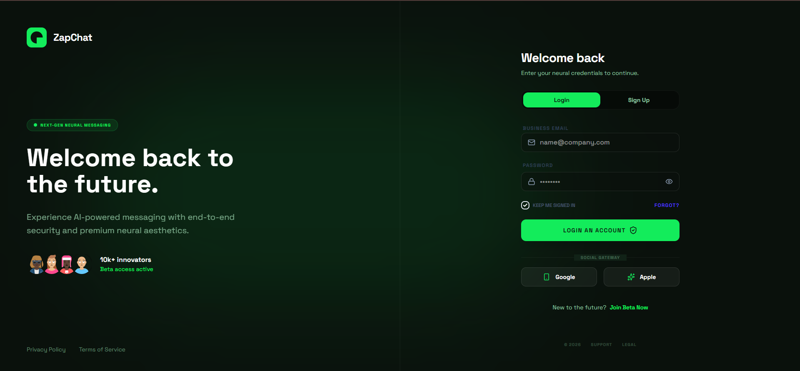
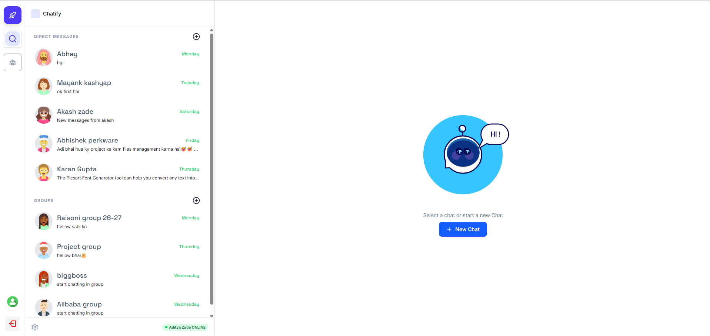

# ⚡ ZapChat – Full Stack Chat Application

ZapChat is a **real-time full-stack chat application** built using the **MERN stack** with **Socket.io** for instant messaging.
The application allows users to **create accounts, log in securely using JWT authentication, and communicate with other users in real time**.
The main goal of this project was to build a **scalable and modern messaging platform** while learning real-time communication, authentication, and full-stack development.

ZapChat provides a **smooth chat experience with a responsive interface and secure backend architecture.**

---
### 🏠 *Auth-page*

### 🏠 *Homepage*

# 🛠 Technologies Used

## 🎨 Frontend
◦ React.js  
◦ Tailwind CSS  
◦ React Router  
◦ Axios  

## ⚙️ Backend
◦ Node.js  
◦ Express.js  
◦ MongoDB  
◦ Mongoose  

## 📡 Real-Time Communication
◦ Socket.io  

## 🔐 Authentication & Security
◦ JWT (JSON Web Token)  
◦ bcryptjs  
◦ Cookie Parser  

## 🧰 Other Tools
◦ Vite  
◦ Git  
◦ GitHub  

---

# ✨ Features

◦ 🔐 Secure JWT Authentication  
◦ 👤 User Signup & Login  
◦ 💬 Real-time messaging using Socket.io  
◦ 📡 Instant message updates  
◦ 🟢 Online user status  
◦ 📂 Chat history stored in MongoDB  
◦ 🧑 User profile system  
◦ 📱 Fully responsive UI  
◦ 🛡 Secure API routes  
◦ ⚡ Fast and modern UI with Tailwind CSS  
◦ 🔎 User list to start conversations  
◦ 🔄 Real-time socket connection management  

---

# 📚 What I Learned

Through building **ZapChat**, I gained hands-on experience with:

◦ Building a full-stack MERN application  
◦ Implementing real-time communication using Socket.io  
◦ Creating secure authentication using JWT  
◦ Structuring a scalable Node.js & Express backend  
◦ Managing MongoDB databases with Mongoose  
◦ Handling real-time events and socket connections  
◦ Protecting API routes with authentication middleware  
◦ Building a responsive UI using React and Tailwind CSS  
◦ Managing application state and API requests  
◦ Organizing full-stack project architecture  

---

# 🚀 Future Improvements

◦ Message reactions  
◦ Image / file sharing  
◦ Voice & video chat  
◦ Push notifications  

---

# 👨‍💻 Author

**Aditya Zade**  
Full-Stack MERN Developer

---

⭐ If you like this project, consider giving it a **star on GitHub**.
